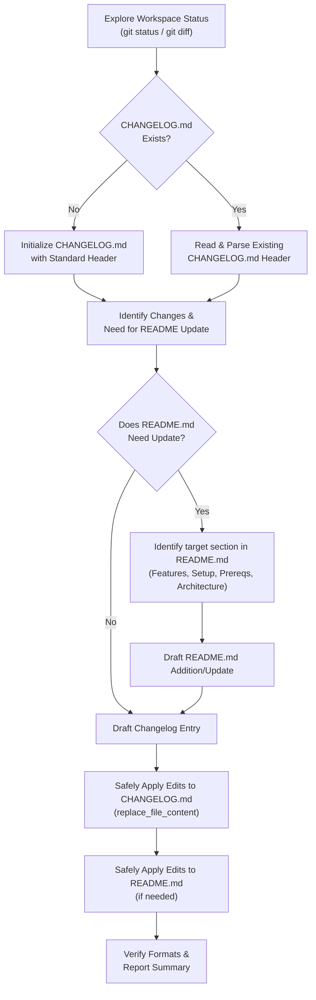

# Changelog and README Auto-Updater Skill

This developer skill guides AI agents in conducting automated analysis of project modifications, structuring them into professional, human-readable descriptions, merging them into the root `CHANGELOG.md` file, and keeping the `README.md` perfectly in sync with the codebase.

---

## When to Apply

Invoke this skill:
- **At the end of every task or feature branch** before asking for final user review.
- **Whenever significant files** (e.g., config files, schemas, visual/styles sheets, core controllers) are added or modified.
- **Whenever a new feature, environment dependency, CLI parameter, or setup command** is added (triggers both Changelog and README updates).
- **Prior to preparing a release** or version bump.

---

## Workflow Overview

The following diagram illustrates the lifecycle of the automatic documentation update process:



---

## Standard Categories (Changelog)

All changelog changes must be classified under one of these standard sections. Do not create arbitrary headings.

| Category | Description | Examples |
| :--- | :--- | :--- |
| **`### Added`** | New features, scripts, components, templates, assets, or pages. | * "Add drag-and-drop file upload to home dashboard."<br>* "Add Lucide icons support in `renderer.js`." |
| **`### Changed`** | Updates to existing functionality, visual styles, configurations, or dependencies. | * "Refactor state management in `useAudioEngine` for better performance."<br>* "Update `tailwind.config.js` to support true glassmorphism." |
| **`### Fixed`** | Bug fixes, visual alignments, lint resolutions, security holes, or hotfixes. | * "Fix layout shift in thumbnail lists under Chromium."<br>* "Fix memory leak in Tone.js initialization lifecycle." |
| **`### Removed`**| Deleted features, deprecated dead code, or redundant packages. | * "Remove legacy CSS rules from `styles.css`."<br>* "Remove unused `utils.js` script." |
| **`### Security`** | Improvements to authentication, credentials protection, or vulnerability patches. | * "Move sensitive API keys from frontend variables to server-side proxy." |

---

## README Update Trigger Criteria

An AI agent must update the root `README.md` if the codebase changes meet any of the following criteria:

1. **New Key Feature Introduced**: Any addition that alters the capabilities of the application (e.g., adding subtitle support, downloading playlists, customizable quality formats).
2. **Prerequisites & Dependencies Changed**: Additions of external executable requirements (e.g., `ffmpeg`, python-libs) or new packages that need specific environmental configuration.
3. **Setup or Build Command Modifications**: Any changes to setup commands (e.g., `npm run build`, `docker-compose up`, `npm run dist`).
4. **Architectural Changes**: Shift in project folders, component models, or major visual styling architectures (e.g. migrating from Tailwind to Vanilla CSS, or changes to IPC bridge scripts).

---

## Detailed Step-by-Step Execution

### Step 1: Analyze Workspace Context

1. **Verify Git Status**:
   Execute standard status commands to identify changed files:
   ```bash
   git status
   ```
2. **Review Diff**:
   Inspect the code changes to understand the technical details and purpose:
   ```bash
   git diff
   ```
3. **List Affected Areas**:
   Create a list of files that were created, modified, or deleted.

### Step 2: Initialize or Read Documentation Files

1. **Changelog**:
   - Locate `CHANGELOG.md` in the root.
   - If not present, initialize it using the Keep a Changelog template.
   - If present, view the top 50 lines to grab the insertion point.
2. **README**:
   - Locate `README.md` in the root.
   - If not present, create it with standard sections: Title, Key Features, Architecture, Prerequisites, Getting Started, and License.
   - If present, view the file to identify where the update belongs (e.g., `## Key Features`, `## System Prerequisites`, or `## Automated Skills System`).

### Step 3: Draft the Entries

1. **Changelog Entry**:
   - Determine date or version block.
   - Draft descriptive bullet points under the standard categories, starting with an **imperative verb** (e.g., "Add", "Fix", "Refactor").
2. **README Entry**:
   - Draft additions using the exact tone and markdown structure of the existing `README.md`.
   - Keep bullet points concise and use inline code blocks for filenames, variables, and commands.

### Step 4: Safely Apply Edits

1. **Update `CHANGELOG.md`**:
   - Apply edits via `replace_file_content` targeting the top date or version block.
2. **Update `README.md`**:
   - Apply edits via `replace_file_content` targeting the specific section. Ensure no headers are broken and formatting remains intact.

### Step 5: Verify & Report

1. **Read-back Validation**:
   Inspect both files using `view_file` to ensure markdown rendering is clean and formatting is completely preserved.
2. **Summarize**:
   Present a clear summary of both updates (Changelog and README) to the user.

---

## Anti-Patterns & Pitfalls to Avoid

- ❌ **The "Documentation Out-of-Sync" Pitfall**: Only updating the changelog but leaving the README with outdated feature descriptions, instructions, or prerequisites.
- ❌ **The "Vague Entry" Pitfall**: Listing entries like `- Fix bug` or `- Update main.js`. Instead, specify *what* was fixed or updated: `- Fix visual overflow in main container on Chromium.`
- ❌ **The "Git Commit Copy-Paste" Pitfall**: Raw commit messages like `git commit -m "wip"` are highly technical and noisy. Always clean and translate them into polished user-facing bullets.
- ❌ **The "History Overwrite" Pitfall**: Accidentally wiping out previous documentation history. Always read and target a precise block of the header to inject your changes, leaving old records intact.
